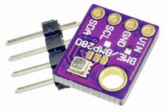

# Arduino BME280 (GY-21P) library

**Author: unknown**  
**Arduino C Application**  
**IDE/structure: VSCode + PlatformIO**  

## DESCRIPTION

Arduino BME280 (GY-21P) (temperature, pressure, altitude, humidity) sensor library.

## USAGE

Make sure to set the correct I2C or SPI values (addresses, etc.).  
Run it and check serial monitor.  

## CHANGELOG

## BACKLOG
